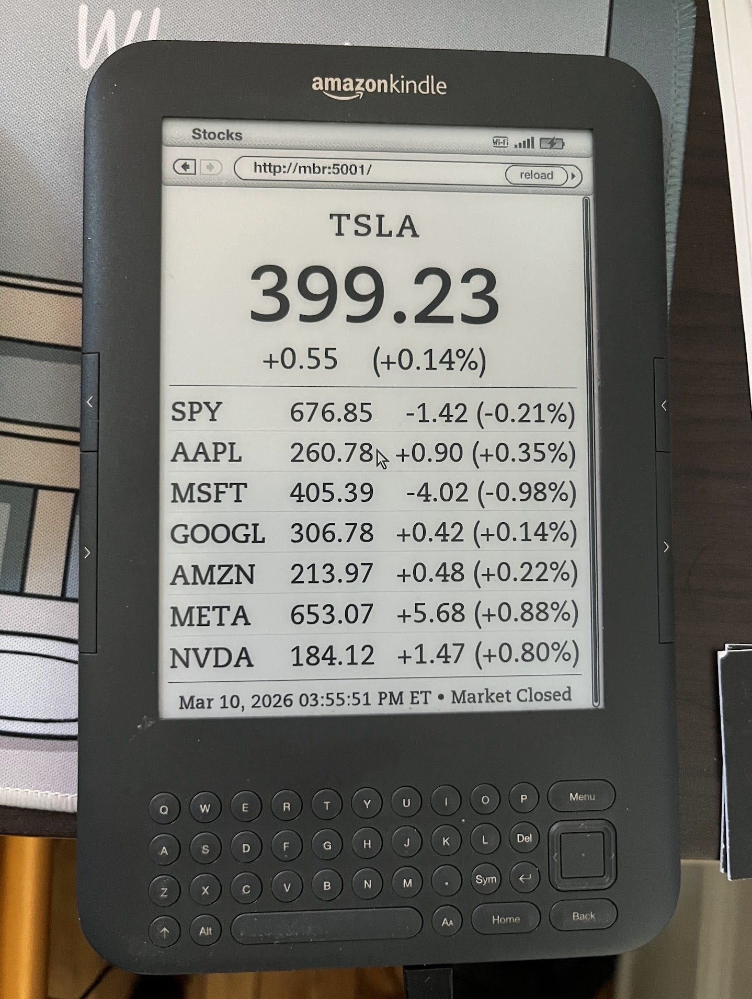

# Kindle Stock Ticker

A Kindle-compatible stock-price display page served by a Python/Flask server running in Docker.

Designed for the **Amazon Kindle 3 (Keyboard)** browser, which renders basic HTML with no JavaScript. The page auto-refreshes using an HTML `<meta http-equiv="refresh">` tag. Stock data is sourced from the [Finnhub API](https://finnhub.io).

---

## Gallery



---

## Features

- **Main ticker** displayed in large type (3× the font size of secondary tickers)
- **Up to 7 secondary tickers** in a table below: symbol, price, $ change, % change
- **Market-hours aware** – the Finnhub API is called only on weekdays within the configured trading window (Eastern Time); cached prices are served outside those hours
- **In-memory cache** – API is called at most once per `REFRESH_INTERVAL` seconds
- **Last-refresh timestamp** and market-closed indicator at the bottom of every page

---

## Prerequisites

| Tool | Purpose |
|---|---|
| [Docker Desktop](https://www.docker.com/products/docker-desktop/) | Build and run the container |
| [Finnhub API key](https://finnhub.io) | Free tier is sufficient (60 req/min) |
| Kindle 3 (or any browser) | Display the page |

---

## Quick Start

### 1. Clone the repository

```bash
git clone https://github.com/<your-username>/<your-repo>.git
cd <your-repo>
```

### 2. Edit `docker-compose.yml`

All configuration lives in the `environment:` block of `docker-compose.yml`. Open it and fill in your values:

```yaml
environment:
  FINNHUB_API_KEY: "your_actual_key_here"   # ← required
  MAIN_TICKER: "SPY"
  TICKERS: "SPY,AAPL,MSFT,GOOGL,AMZN,META,TSLA,NVDA"
  REFRESH_INTERVAL: "300"
  MARKET_OPEN: "09:30"
  MARKET_CLOSE: "16:00"
  PORT: "5001"
```

> ⚠️ **API key security:** If your GitHub repository is **public**, do not commit your real `FINNHUB_API_KEY` in `docker-compose.yml`. Use a **private repo**, or pass the key as a shell environment variable:
> ```bash
> FINNHUB_API_KEY=your_key docker compose up --build -d
> ```
> and set `FINNHUB_API_KEY: "${FINNHUB_API_KEY}"` in the compose file.

### 3. Build and run with Docker

```bash
docker compose up --build -d
```

The server starts on port **5001**. Open `http://localhost:5001` in any browser to verify.

To stop:

```bash
docker compose down
```

To view logs:

```bash
docker compose logs -f
```

---

## Configuration Reference

All variables are set in the `environment:` section of `docker-compose.yml`.

| Variable | Default | Description |
|---|---|---|
| `FINNHUB_API_KEY` | *(required)* | Your Finnhub API key |
| `MAIN_TICKER` | `SPY` | Primary ticker shown large at the top |
| `TICKERS` | `SPY,AAPL,...` | Comma-separated list of all tickers. `MAIN_TICKER` is removed from the secondary list automatically. Only the first 7 non-main tickers are shown. |
| `REFRESH_INTERVAL` | `300` | Seconds between browser refresh and API poll |
| `MARKET_OPEN` | `09:30` | Market open time, Eastern Time, 24h format |
| `MARKET_CLOSE` | `16:00` | Market close time, Eastern Time, 24h format |
| `PORT` | `5001` | Port the server listens on (must match `ports:` in docker-compose.yml) |

> **Market holidays:** The server checks only weekday + time. U.S. market holidays (e.g., Thanksgiving, Christmas) are not automatically excluded. On those days the API will return zeros; cached data from the previous session will be served if available.

---

## Running Locally (Without Docker)

Requires Python 3.11+.

```bash
python -m venv .venv
# Windows:
.venv\Scripts\activate
# macOS / Linux:
source .venv/bin/activate

pip install -r requirements.txt
```

Set the required variables in your shell before running:

```bash
# Windows PowerShell
$env:FINNHUB_API_KEY="your_key"; $env:MAIN_TICKER="SPY"; python app.py

# macOS / Linux
FINNHUB_API_KEY=your_key MAIN_TICKER=SPY python app.py
```

The server starts at `http://localhost:5001`.

---

## Kindle Setup

1. Make sure the Kindle and the machine running the server are on the **same Wi-Fi network**.
2. Find the server's local IP address:
   - Windows: `ipconfig` → look for IPv4 Address (e.g., `192.168.1.42`)
   - macOS/Linux: `ifconfig` or `ip addr`
3. On the Kindle, open the browser and navigate to:
   ```
   http://192.168.1.42:5001
   ```
4. The page will auto-refresh every `REFRESH_INTERVAL` seconds.

> **Tip:** If you run the Docker container on a Raspberry Pi or a NAS on your local network, the Kindle can display stock data continuously with no PC required.

---
## Keeping the Kindle Gen 3 screen awake

By default the Kindle goes to screensaver after a few minutes, interrupting the display. Use the hidden **`~ds` (disable screensaver)** command to prevent this.

### Steps

1. Go to the **Home screen**.
2. Using the keyboard, type **`~ds`** — it will appear in the search bar.
3. Press **Enter** (select "Search everywhere" or similar if prompted).
4. The screen may flicker briefly. The Kindle will no longer enter screensaver mode.

### Important limitations

- **Resets on reboot.** The setting is lost whenever the Kindle restarts or the battery dies completely. You must re-enter `~ds` each time.
- **Battery drain.** With the screen always on and Wi-Fi active for refreshing, battery drains faster than normal. **Keep the Kindle plugged in** while using it as a display.
- **Older firmware only.** This command works on Kindle Gen 3 (Kindle Keyboard) and similarly aged devices. It does not work on newer Kindles.
- **Magnetic cases.** If `~ds` seems to have no effect, check whether you are using a magnetic cover — the magnet can continuously trigger the sleep sensor and override the setting.

### If `~ds` doesn't work — Debug Mode method

Some firmware versions require Debug Mode to be active before the screensaver command is recognised.

1. On the **Home screen**, type **`;debugOn`** into the search bar and press **Enter**.
2. Type **`~disableScreensaver`** and press **Enter**.
3. Optionally, type **`;debugOff`** and press **Enter** to exit debug mode.

### Tip

Set the Kindle's browser **bookmark** to `http://<your-server-ip>:5001` so it opens directly to the weather page after each reboot.

---


## Publishing to GitHub

### First time

```bash
# Inside the project directory
git init
git add .
git commit -m "Initial commit: Kindle stock ticker"

# Create a new repo on GitHub (via the website or gh CLI):
gh repo create <repo-name> --public --source=. --remote=origin --push
# OR manually:
git remote add origin https://github.com/<your-username>/<repo-name>.git
git branch -M main
git push -u origin main
```

### Subsequent pushes

```bash
git add .
git commit -m "Your message"
git push
```

> ⚠️ **Before pushing:** if the repo is public, make sure `FINNHUB_API_KEY` in `docker-compose.yml` still contains only the placeholder `"your_api_key_here"`, not your real key. Your tickers, port, and timing settings are fine to commit.

---

## Project Structure

```
.
├── app.py                  # Flask server – cache, Finnhub client, route
├── templates/
│   └── index.html          # Kindle-compatible HTML template (no JS)
├── screenshots/
│   └── kindle-stock-ticker.jpg  # Gallery photo
├── requirements.txt        # Python dependencies
├── Dockerfile              # Single-stage Python 3.11-slim image
├── docker-compose.yml      # Compose service definition + ALL configuration
├── .dockerignore           # Files excluded from the Docker build context
└── .gitignore              # Files excluded from git
```

---

## Architecture Notes

- **Single Gunicorn worker** is intentional. The quote cache lives in Python memory; multiple workers would each maintain their own cache and make redundant API calls.
- **No JavaScript on the page.** All refresh logic uses the HTML `<meta http-equiv="refresh">` tag, which the Kindle 3 browser supports.
- **Cache behaviour:**
  - On first request (even outside market hours) → API is called once so prices are immediately visible.
  - Subsequent requests within `REFRESH_INTERVAL` → cached data returned, no API call.
  - Outside market hours after first load → stale cache served, API never called.
  - During market hours, cache expired → API called and cache updated.
